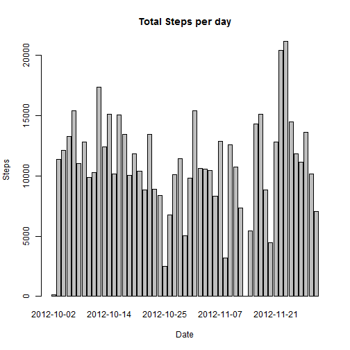
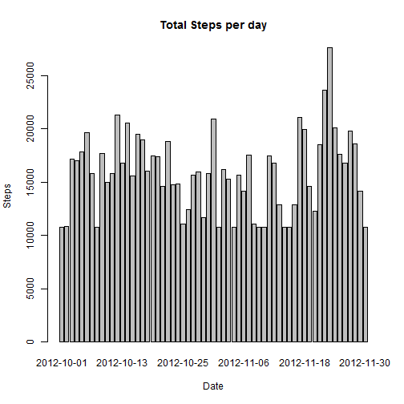

# Reproducible Research: Peer Assessment 1
This report details the analysis required for the Peer Assessment 1 of 
the Reproducible Research Coursera course.

### Context
This assignment makes use of data from a personal activity monitoring
device. This device collects data at 5 minute intervals through out the
day. The data consists of two months of data from an anonymous
individual collected during the months of October and November, 2012
and include the number of steps taken in 5 minute intervals each day.

### Data
The data for this assignment can be downloaded from the course web
site:

* Dataset: [Activity monitoring data](https://d396qusza40orc.cloudfront.net/repdata%2Fdata%2Factivity.zip) [52K]

The variables included in this dataset are:

* **steps**: Number of steps taking in a 5-minute interval (missing
    values are coded as `NA`)

* **date**: The date on which the measurement was taken in YYYY-MM-DD
    format

* **interval**: Identifier for the 5-minute interval in which
    measurement was taken


The dataset is stored in a comma-separated-value (CSV) file and there
are a total of 17,568 observations in this
dataset.

## Loading and preprocessing the data
In order to perform our analysis, the zip file has been downloaded and
extracted in the RepData_PeerAssessment1 folder. The entire dataset has been
loaded into the "activities" data table.

For the first part of the assignment, we take only the observations where the
steps value is not NA.


```r
setwd("C:/R/")
activities <- read.csv("RepData_PeerAssessment1/activity.csv")
activitiesComplete <- activities[complete.cases(activities), ]
```


## What is mean total number of steps taken per day?
In order to analyze the number of steps taken per day, we first need to prepare
data by aggregating steps count by date. For this task I udes the plyr ddply function.


```r
library(plyr)
library(ggplot2)
dt <- ddply(activitiesComplete,~date,summarise,steps=sum(steps))
```


##### 1. Make a histogram of the total number of steps taken each day
The total number of steps per day has been plotted using the barplot function as 

```r
barplot(dt$steps, names.arg = dt$date, xlab = "Date", ylab = "Steps", main = "Total Steps per day")
```

 

##### 2. Calculate and report the **mean** and **median** total number of steps taken per day

I calculate the mean and median using the standard R functions

```r
mean <- mean(dt$steps)
median <- median(dt$steps)
```

Which gives me a mean of 10766 steps and a median of 10765 steps.


## What is the average daily activity pattern?

##### 1. Make a time series plot (i.e. `type = "l"`) of the 5-minute interval (x-axis) and the average number of steps taken, averaged across all days (y-axis)

In order to plot the average number of steps taken per interval, we need to aggregate the 
complete cases by interval. I used in this case the aggregate function.

Then the resulting data is plotted using a time series.


```r
dt <- aggregate(steps ~ interval, data = activitiesComplete, FUN = function(x){mean(x)})
plot(dt, type = "l")
```

 

##### 2. Which 5-minute interval, on average across all the days in the dataset, contains the maximum number of steps?

The interval which contains the maximum number of steps has been calculated with the previously 
created data frame as

```r
max <- dt$interval[which.max(dt$steps)]
```

and it result to be interval 835.

## Inputing missing values

##### 1. Calculate and report the total number of missing values in the dataset (i.e. the total number of rows with `NA`s)


```r
count <- nrow(activities[is.na(activities$steps), ])
```

There are 2304 rows without step information.

##### 2. Devise a strategy for filling in all of the missing values in the dataset. The strategy does not need to be sophisticated. For example, you could use the mean/median for that day, or the mean for that 5-minute interval, etc.

As a strategy, I decided to use the average for the 5-minute interval across all days.

##### 3. Create a new dataset that is equal to the original dataset but with the missing data filled in.


```r
activityAll <- merge(activities, dt, by = "interval", suffixes = c("", ".y"))
nas <- is.na(activityAll$steps)
activityAll$steps[nas] <- activityAll$steps.y[nas]
```
##### 4. Make a histogram of the total number of steps taken each day and Calculate and report the **mean** and **median** total number of steps taken per day. Do these values differ from the estimates from the first part of the assignment? What is the impact of imputing missing data on the estimates of the total daily number of steps?
I calculate again the mean and median using the standard R functions

```r
mean <- mean(activityAll$steps)
median <- median(activityAll$steps)
```

Which gives me a mean of 37 steps and a median of 0 steps.


```r
dt <- ddply(activityAll,~date,summarise,steps=sum(steps))
barplot(dt$steps, names.arg = dt$date, xlab = "Date", ylab = "Steps", main = "Total Steps per day")
```

 

## Are there differences in activity patterns between weekdays and weekends?

##### 1. Create a new factor variable in the dataset with two levels -- "weekday" and "weekend" indicating whether a given date is a weekday or weekend day.


```r
activityAll$date <- as.Date(activityAll$date)
activityAll$datType <- as.factor(sapply(activityAll$date, function(x) { 
  if (weekdays(as.Date(x)) %in% c("Saturday", "Sunday")) {
    "weekend"
  } else {
    "weekday"
  }}))
```
##### 2. Make a panel plot containing a time series plot (i.e. `type = "l"`) of the 5-minute interval (x-axis) and the average number of steps taken, averaged across all weekday days or weekend days (y-axis).

```r
dt <- ddply(activityAll,.(interval, datType),summarise,steps=mean(steps))
g <- ggplot(aes(interval, steps), data = dt) + facet_grid(datType ~ .) + geom_line()
print(g)
```

 


```r
# Record R session info
si <- sessionInfo()

# Privacy matters
si$locale <- '... [removed for privacy purposes, irrelevant to this analysis]'

# Show it
si
```

```
## R version 3.1.0 (2014-04-10)
## Platform: x86_64-w64-mingw32/x64 (64-bit)
## 
## locale:
## [1] ... [removed for privacy purposes, irrelevant to this analysis]
## 
## attached base packages:
## [1] stats     graphics  grDevices utils     datasets  methods   base     
## 
## other attached packages:
## [1] plyr_1.8.1    knitr_1.6     devtools_1.5  slidify_0.4.5 ggplot2_1.0.0
## [6] shiny_0.10.1 
## 
## loaded via a namespace (and not attached):
##  [1] bitops_1.0-6     caTools_1.17     codetools_0.2-8  colorspace_1.2-4
##  [5] digest_0.6.4     evaluate_0.5.5   formatR_0.10     grid_3.1.0      
##  [9] gtable_0.1.2     htmltools_0.2.4  httpuv_1.3.0     httr_0.3        
## [13] labeling_0.2     markdown_0.7     MASS_7.3-31      memoise_0.2.1   
## [17] munsell_0.4.2    parallel_3.1.0   proto_0.3-10     Rcpp_0.11.2     
## [21] RCurl_1.95-4.1   reshape2_1.4     RJSONIO_1.3-0    rmarkdown_0.2.49
## [25] scales_0.2.4     shinyapps_0.3.56 stringr_0.6.2    tools_3.1.0     
## [29] whisker_0.3-2    xtable_1.7-3     yaml_2.1.13
```
